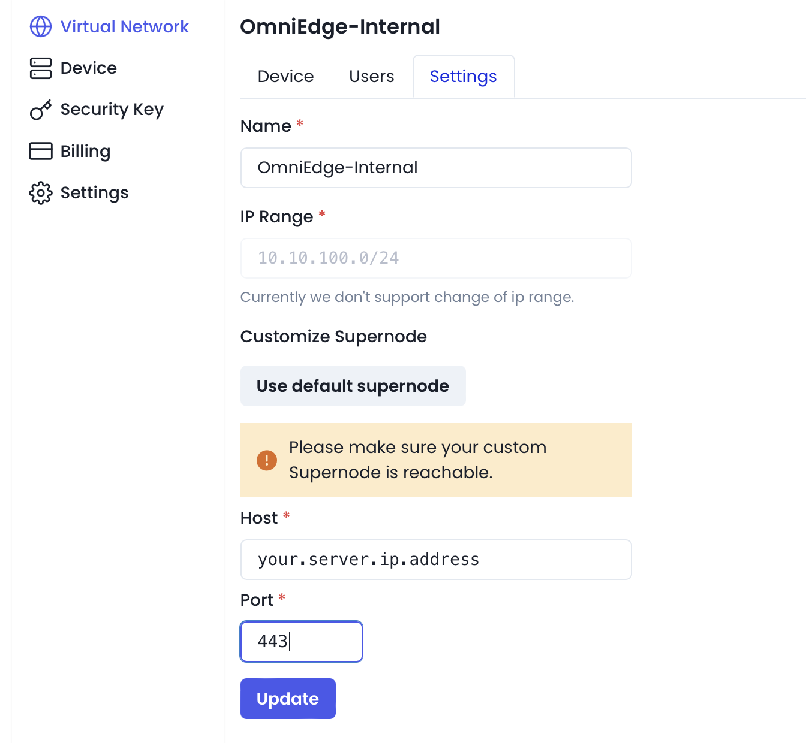

# Customize supernode server

OmniEdge offers customize supernode, You can setup your own Supernode server to increase security and speed for your Virtual Network, here you can setup a supernode server with docker.

# Installation

## By run a command 

```bash
curl https://raw.githubusercontent.com/omniedgeio/docker-customize-supernode/main/install.sh | bash

1) 2.6-stable-omni
2) 3.0-stable
3) Quit
Please enter your choice: 1

#Select 1 with 2.6-stable-omni for current version
#Default port is 443

```

## Setting in the Omniedge Dashboard

Login in your OmniEdge account, and setting in the dashboard with your own **Server IP** and **port**, the defualt port of this Dockerfile is **443**.




